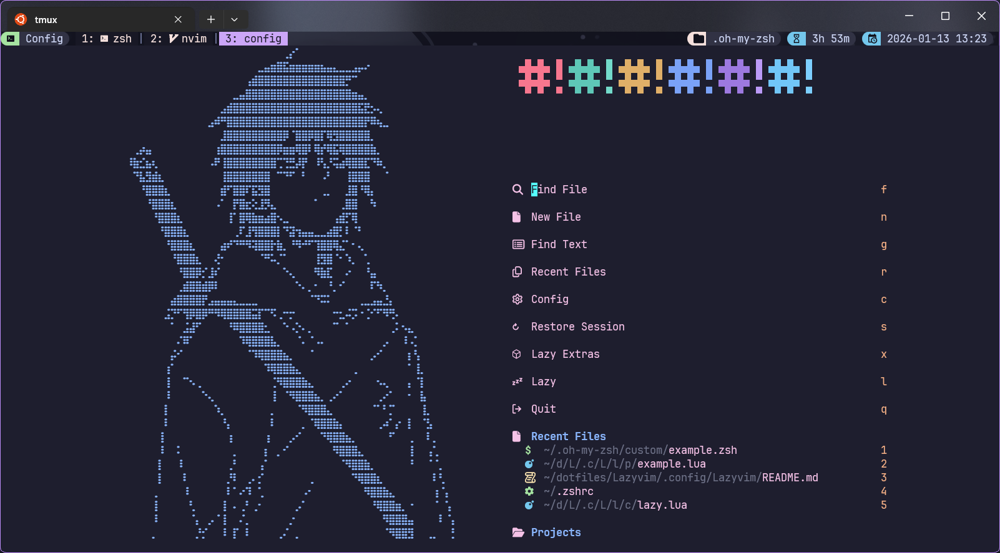
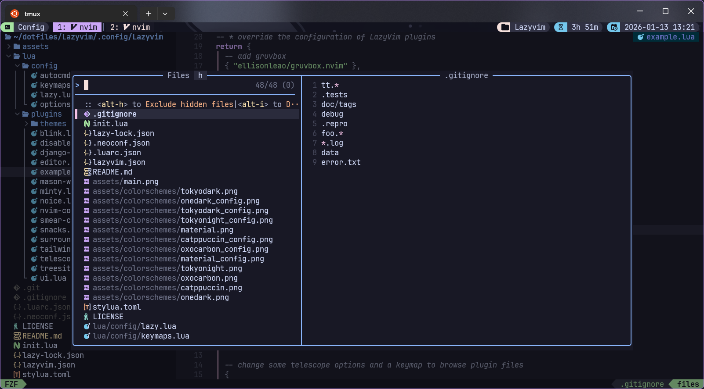
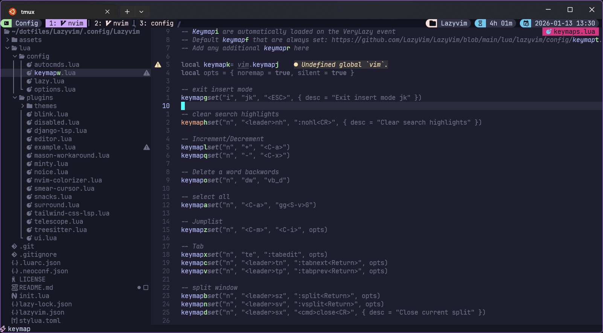
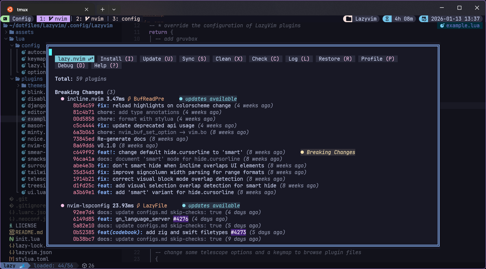
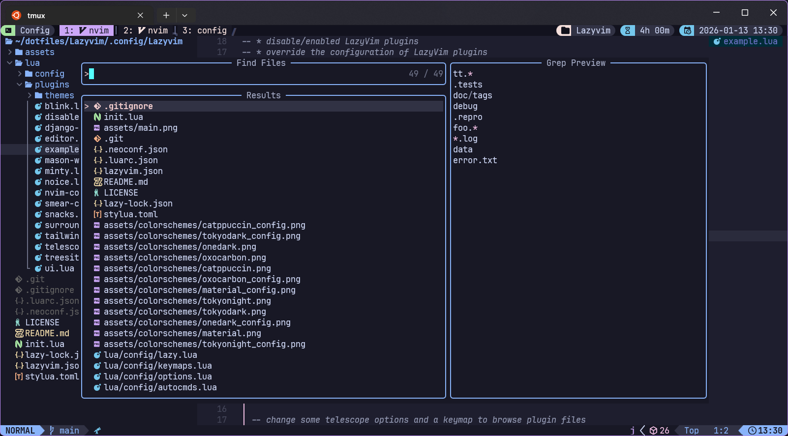
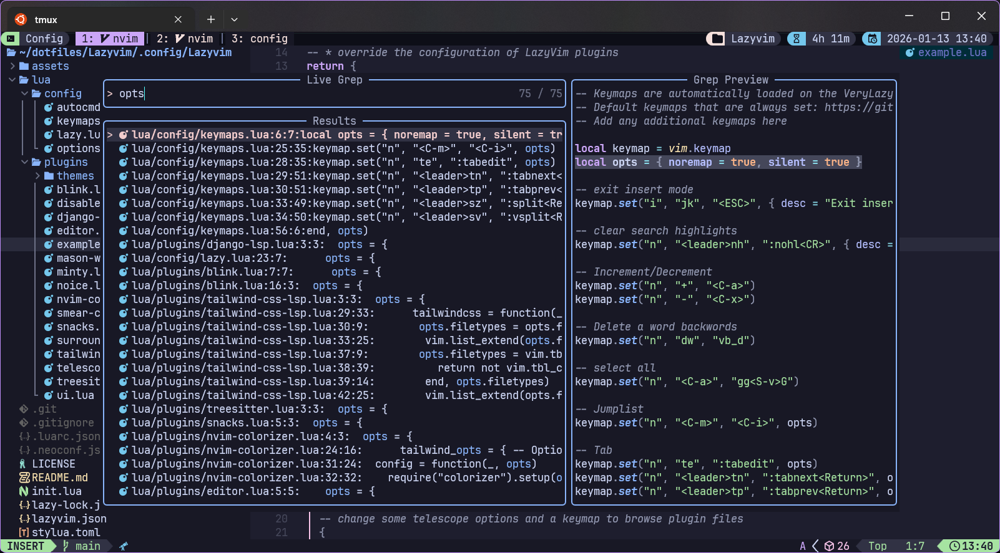
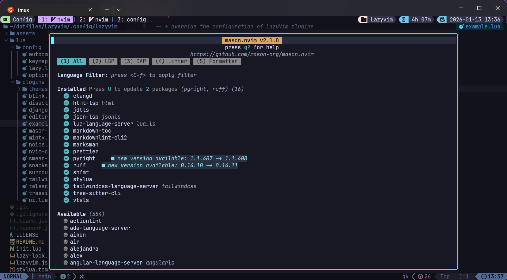

<h1 align="center">
  💤 Lazyvim
</h1>

<div align="center">
  
  
  
  
  
  
  
  
  
</div>

<br>

<div align="center">
  
</div>

---

## 🌿 Introduction

Hii there!👋

Welcome to my personal **Neovim** configuration for Linux (WSL2), macOS and windows. A Lazyvim-based configuration tailored for developers to supercharge their workflows.
This setup of **Lazyvim** offers an aesthetically pleasing and highly efficient editing experience.

> [!NOTE]
> Check out my [**Dotfiles**](https://github.com/abhicodes07/dotfiles) configurations curated for WSL2 based systems 🌟.

## ✨ Core Features

- 💤 **Lazy-loading plugins** for optimal performance
- 🔍 A **fuzzy finder** for projects, files, and beyond
- 🔄 Easy switching between **terminal and Neovim**
- 🛠️ **LSP** support for code completions and diagnostics
- 📦 **Mason** for managing LSP servers, formatters, and linters
- 🖌️ Beautiful **colorschemes** and UI enhancements

## 📦 Installation & Setup

> [!WARNING]
> My configurations are heavily polished over the years so it is not recommended
> to clone the whole repository and use it.

> It is recommended to create your own unique configuration as personal configurations are always better.
> You are encouraged to copy from this repo any part you want and add it to your own config. ✨

<details>
<summary><b>🔤 Installing fonts</b></summary>
<br>
Nerd fonts are required since **Neovim** and some of it's plugins often use Unicode symbols
not available in normal fonts.

1. Visit the [**Nerd Fonts website**](https://www.nerdfonts.com/).
2. Download your preferred font.

> ✨ JetBrainsMono Nerd Font recommended

3. Configure your terminal to use the installed Nerd Font.

</details>

<details>
<summary><b>💤 Install Neovim</b></summary>
<br>
There are various ways to install Neovim depending on your system.

> Install requires Neovim 0.10+. Always review the code before installing a configuration.

Please check the official documentation on how to install Neovim on different systems: [ **Install Neovim** ](https://github.com/neovim/neovim/blob/master/INSTALL.md)

</details>

<details>
<summary><b>⚙️ Setting up Lazyvim</b></summary>
<br>
After installing nvim and all the dependencies, we will install plugin managers and set up this config.

### Install this config:

- Make a backup of your current **Neovim** config (if any):

```sh
mv ~/.config/nvim ~/.config/nvim.bak
mv ~/.local/share/nvim ~/.local/share/nvim.bak
```

- Clone the repository and install the plugins:

```sh
git clone https://github.com/abhicodes07/Lazyvim.git ~/.config/Lazyvim
```

On Windows, the config directory is `$HOME/AppData/Local/nvim`.

- Setup your shell to use this configuration, add the following line in `zshrc` or `bashrc`:

```sh
  NVIM_APPNAME=Lazyvim nvim
```

After that, when we first open nvim, all the plugins will be installed automatically. It may take some time to install all the plugins.

</details>

## 🚀 Insights

<details>
  <summary><b>🎨 Core plugins</b></summary>
  <br>
  <table>
    <tr>
      <th>
        <a href="https://github.com/folke/snacks.nvim">Snacks Welcome</a>
      </th>
      <th>
        <a href="https://github.com/ibhagwan/fzf-lua">FZF</a>
      </th>
    </tr>
    <tr>
      <td>
        
      </td>
      <td>
        
      </td>
    </tr>
    <tr>
      <th>
        <a href="https://github.com/folke/flash.nvim">Flash</a>
      </th>
      <th>
        <a href="https://github.com/folke/lazy.nvim">Lazy</a>
      </th>
    </tr>
    <tr>
      <td>
        
      </td>
      <td>
        
      </td>
    </tr>
    <tr>
      <th>
        <a href="https://github.com/kdheepak/lazygit.nvim">Lazygit</a>
      </th>
      <th>
        <a href="https://github.com/nvim-telescope/telescope.nvim">Telescope Find Files</a>
      </th>
    </tr>
    <tr>
      <td>
        
      </td>
      <td>
        
      </td>
    </tr>
    <tr>
      <th>
        <a href="https://github.com/nvim-telescope/telescope.nvim">Telescope Livegrep</a>
      </th>
      <th>
        <a href="https://github.com/mason-org/mason.nvim">Mason</a>
      </th>
    </tr>
    <tr>
      <td>
        
      </td>
      <td>
        
      </td>
    </tr>
  </table>
</details>

<details>
<summary><b>🍭 Extras</b></summary>
<br>

| 🧩 Plugin                                                                                                | 📜 Description                              |
| -------------------------------------------------------------------------------------------------------- | ------------------------------------------- |
| [**Lazy.nvim**](https://github.com/folke/lazy.nvim)                                                      | Plugin management                           |
| [**nvim-cmp**](https://github.com/hrsh7th/nvim-cmp) and [**Blink**](https://github.com/saghen/blink.cmp) | Code, snippet, word auto-completion         |
| [**nvim-lspconfig**](https://github.com/neovim/nvim-lspconfig).                                          | Language server protocol (LSP) support      |
| [**fzf-lua**](https://github.com/ibhagwan/fzf-lua).                                                      | Ultra-fast project-wide fuzzy searching     |
| [**lualine.nvim**](https://github.com/nvim-lualine/lualine.nvim)                                         | Beautiful statusline                        |
| [**nvim-tree.lua**](https://github.com/nvim-tree/nvim-tree.lua)                                          | File tree explorer                          |
| [**which-key.nvim**](https://github.com/folke/which-key.nvim)                                            | User-defined mapping hint                   |
| [**nvim-treesitter**](https://github.com/nvim-treesitter/nvim-treesitter)                                | Code highlighting                           |
| [**render-markdown.nvim**](https://github.com/MeanderingProgrammer/render-markdown.nvim)                 | Markdown previewing                         |
| [**nvim-notify**](https://github.com/rcarriga/nvim-notify)                                               | Animated GUI style notification             |
| [**trouble.nvim**](https://github.com/folke/trouble.nvim)                                                | File Diagnostics                            |
| [**nvim-surround**](https://github.com/kylechui/nvim-surround)                                           | Add/delete/change surrounding pairs.        |
| [**bufferline.nvim**](https://github.com/akinsho/bufferline.nvim)                                        | Snazzy Bufferline                           |
| [**noice.nvim**](https://github.com/folke/noice.nvim)                                                    | UI for messages, cmdline and the popup menu |

</details>

<details>
  <summary><b>📚 Colorschemes</b></summary>
  <br>
  <table>
    <tr>
      <th colspan="2">
        <a href="https://github.com/tiagovla/tokyodark.nvim">Tokyodark</a>
      </th>
    </tr>
    <tr>
      <td width="50%">
        
      </td>
      <td width="50%">
        
      </td>
    </tr>
    <tr>
      <th colspan="2">
        <a href="https://github.com/marko-cerovac/material.nvim">Material</a>
      </th>
    </tr>
    <tr>
      <td width="50%">
        
      </td>
      <td width="50%">
        
      </td>
    </tr>
    <tr>
      <th colspan="2">
        <a href="https://github.com/catppuccin/nvim">Catppuccin</a>
      </th>
    </tr>
    <tr>
      <td width="50%">
        
      </td>
      <td width="50%">
        
      </td>
    </tr>
    <tr>
      <th colspan="2">
        <a href="https://github.com/nyoom-engineering/oxocarbon.nvim">Oxocarbon</a>
      </th>
    </tr>
    <tr>
      <td width="50%">
        
      </td>
      <td width="50%">
        
      </td>
    </tr>
    <tr>
      <th colspan="2">
        <a href="https://github.com/navarasu/onedark.nvim">Onedark</a>
      </th>
    </tr>
    <tr>
      <td width="50%">
        
      </td>
      <td width="50%">
        
      </td>
    </tr>
    <tr>
      <th colspan="2">
        <a href="https://github.com/folke/tokyonight.nvim">Tokyonight</a>
      </th>
    </tr>
    <tr>
      <td width="50%">
        
      </td>
      <td width="50%">
        
      </td>
    </tr>
  </table>
</details>

<p align="center">
	
</p>

<div align="center">
  <a href="https://github.com/abhicodes07/Lazyvim?tab=Apache-2.0-1-ov-file">
    
  </a>
</div>
<p align="center">
  Copyright &copy; 2026-present <a href="https://github.com/abhicodes07" target="_blank">Abhi9av</a>
</p>
